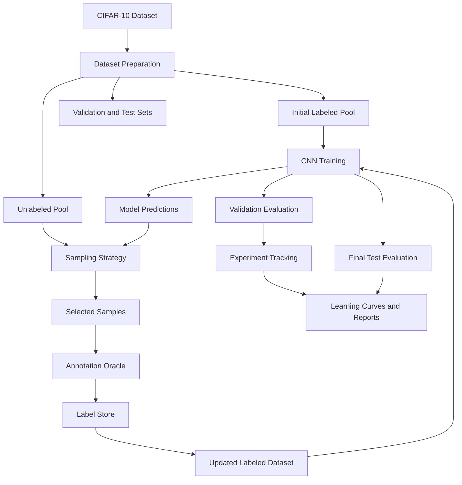

# ORACLE
### Open Research for Active Learning and Continuous Evaluation

**An experimental framework for evaluating whether intelligent sample selection can reduce annotation effort while maintaining model performance.**

---

## Overview

Machine learning models often require large amounts of labeled data. However, manually annotating data can be expensive, time-consuming, and difficult to scale.

**Active Learning** addresses this challenge by allowing a model to select the most informative unlabeled samples for annotation.

ORACLE is a reproducible experimental framework designed to compare two data-selection strategies:

- **Random Sampling:** Selects unlabeled samples randomly.
- **Uncertainty Sampling:** Selects samples for which the model has the lowest prediction confidence.

The project evaluates these strategies on CIFAR-10 using a CNN classifier, iterative annotation, repeated experiments, and quantitative analysis.

The primary objective is to understand how annotation budget influences model performance and whether uncertainty-based selection provides measurable benefits over random selection.

---

## Research Question

> Can an active learning strategy achieve comparable classification performance with fewer labeled samples than random sampling?

To investigate this question, ORACLE:

1. Establishes an initial labeled dataset.
2. Maintains a separate unlabeled pool.
3. Trains a CNN classifier.
4. Selects new samples using different sampling strategies.
5. Simulates annotation through an annotation oracle.
6. Retrains the model at increasing annotation budgets.
7. Evaluates performance using a separate validation and test dataset.
8. Repeats experiments across multiple random seeds.

---

## Key Features

- CIFAR-10 dataset integration
- Reproducible dataset splitting
- CNN-based image classification
- Random and uncertainty-based sample selection
- Simulated human annotation
- Annotation history and duplicate protection
- Iterative model retraining
- Multi-seed experimental evaluation
- Accuracy tracking across annotation budgets
- CSV and JSON result exports
- High-resolution experimental visualizations
- Modular and extensible architecture

---

## System Architecture



---

## Dataset

ORACLE uses the **CIFAR-10** image classification dataset.

| Property | Description |
|---|---|
| Dataset | CIFAR-10 |
| Training images | 50,000 |
| Test images | 10,000 |
| Image dimensions | 32 × 32 pixels |
| Channels | 3 (RGB) |
| Classes | 10 |
| Task | Multiclass image classification |

### Class Labels

1. Airplane
2. Automobile
3. Bird
4. Cat
5. Deer
6. Dog
7. Frog
8. Horse
9. Ship
10. Truck

### Experimental Split

The original training dataset is divided into three subsets:

| Subset | Samples | Purpose |
|---|---:|---|
| Initial labeled pool | 1,000 | Starting training data |
| Unlabeled pool | 44,000 | Active learning candidate samples |
| Validation set | 5,000 | Model evaluation during training |
| Official test set | 10,000 | Final performance evaluation |

The test set remains separate from the training and sample-selection process.

Unlabeled samples are presented to the sampling strategy without exposing their labels through the sampler interface. Labels are revealed only after samples are selected by the annotation oracle.

---

## Methodology

### 1. Random Sampling

Random Sampling selects samples uniformly from the available unlabeled pool without replacement.

**Advantages:**
- Simple implementation
- Low selection overhead
- Useful experimental baseline

**Limitation:**
- Does not consider model uncertainty or sample informativeness.

### 2. Uncertainty Sampling

Uncertainty Sampling selects samples for which the model has low maximum predicted class probability.

For a sample with predicted class probabilities:

\[
P(y \mid x)
\]

The uncertainty score is:

\[
U(x)=1-\max_y P(y\mid x)
\]

A higher uncertainty score indicates lower prediction confidence.

The samples with the highest uncertainty scores are selected for annotation.

**Advantages:**
- Uses model predictions to guide sample selection.
- Prioritizes uncertain examples.
- Provides a practical baseline for active learning research.

**Limitation:**
- Uncertain predictions are not necessarily the most informative.
- Results can depend on model quality, initialization, and training stability.

### 3. Iterative Learning Process

The experiment follows this cycle:

1. Train the CNN on currently labeled samples.
2. Evaluate validation accuracy.
3. Select a batch of unlabeled samples.
4. Reveal their labels through the annotation oracle.
5. Update the label store and labeled dataset.
6. Increase the annotation budget.
7. Train a fresh model at the new budget.
8. Repeat until the maximum budget is reached.

### 4. Experimental Configuration

| Parameter | Value |
|---|---|
| Initial labeled samples | 1,000 |
| Query batch size | 500 |
| Maximum labeled samples | 5,000 |
| Annotation budgets | 1,000 to 5,000 |
| Training epochs per budget | 10 |
| Batch size | 128 |
| Optimizer | Adam |
| Learning rate | 0.001 |
| Loss function | Cross-Entropy |
| Random seeds | 42, 123, 2026 |
| Evaluation metric | Classification accuracy |

Each strategy is evaluated across three random seeds.

Results are summarized using mean accuracy and standard deviation.

---

## Model Architecture

ORACLE uses a custom convolutional neural network (CNN) for CIFAR-10 classification.

The baseline architecture consists of:

- Three convolutional blocks
- Convolutional layers with 32, 64, and 128 channels
- Batch normalization
- ReLU activation
- Max pooling
- Fully connected layer with 256 units
- Dropout with probability 0.3
- Final classification layer with 10 outputs

The same model architecture is used for both sampling strategies to support a controlled comparison.

---

## Experimental Results

### Final Test Accuracy

The following results were obtained from three random seeds using a maximum annotation budget of 5,000 samples.

| Strategy | Mean Test Accuracy | Standard Deviation |
|---|---:|---:|
| Random Sampling | 59.68% | 2.41 |
| Uncertainty Sampling | 56.69% | 6.23 |

**Interpretation:**

In the current experiment, Random Sampling achieved a higher mean final test accuracy than Uncertainty Sampling.

Uncertainty Sampling also showed greater variation across the three random seeds.

These results indicate that uncertainty-based selection did not outperform the random baseline under the current experimental configuration.

However, the experiment uses only three seeds and a limited training budget. The results should therefore be interpreted as preliminary findings rather than a universal conclusion about active learning strategies.

### Validation Accuracy Across Annotation Budgets

| Labeled Samples | Random Sampling | Uncertainty Sampling |
|---:|---:|---:|
| 1,000 | 47.01% | 47.01% |
| 1,500 | 51.27% | 48.13% |
| 2,000 | 51.73% | 51.98% |
| 2,500 | 56.22% | 54.89% |
| 3,000 | 57.23% | 58.09% |
| 3,500 | 59.08% | 56.63% |
| 4,000 | 60.11% | 58.38% |
| 4,500 | 60.66% | 58.20% |
| 5,000 | 60.89% | 58.32% |

The validation results show that performance varies across annotation budgets and sampling strategies. Neither strategy demonstrates a consistent advantage at every intermediate budget.

### Visualizations

#### Learning Curves

Validation accuracy versus annotation budget, with shaded regions representing one standard deviation across random seeds.


#### Final Test Accuracy

Comparison of final test accuracy across the two sampling strategies.


#### Annotation Efficiency

Change in validation accuracy as the annotation budget increases.


---

## Project Structure

```text
ORACLE/
│
├── data/
│   └── raw/
│
├── experiments/
│   ├── plots/
│   │   ├── learning_curves.png
│   │   ├── final_test_accuracy.png
│   │   ├── annotation_efficiency.png
│   │   ├── multi_seed_learning_curve.png
│   │   └── strategy_comparison.png
│   │
│   ├── multi_seed_comparison.py
│   ├── plot_results.py
│   ├── multi_seed_metrics.csv
│   ├── multi_seed_aggregate.csv
│   ├── multi_seed_test_summary.json
│   └── multi_seed_summary.json
│
├── models/
│   ├── baseline_cnn.pth
│   ├── random_seed_42_final.pth
│   ├── random_seed_123_final.pth
│   ├── random_seed_2026_final.pth
│   ├── uncertainty_seed_42_final.pth
│   ├── uncertainty_seed_123_final.pth
│   └── uncertainty_seed_2026_final.pth
│
├── src/
│   ├── data/
│   │   ├── dataset.py
│   │   └── unlabeled_dataset.py
│   │
│   ├── models/
│   │   └── cnn.py
│   │
│   └── active_learning/
│       ├── random_sampler.py
│       ├── uncertainty_sampler.py
│       ├── annotation_oracle.py
│       ├── label_store.py
│       └── labeled_dataset.py
│
├── tests/
│
├── requirements.txt
├── README.md
└── .gitignore
```

---

## Installation

### Prerequisites

- Python 3.10 or later, compatible with the installed PyTorch and torchvision versions
- Git
- pip

### 1. Clone the Repository

```bash
git clone <YOUR_GITHUB_REPOSITORY_URL>
cd ORACLE
```

Replace the placeholder with the actual GitHub repository URL.

### 2. Create a Virtual Environment

Windows PowerShell:

```powershell
python -m venv .venv
.venv\Scripts\Activate.ps1
```

### 3. Install Dependencies

```bash
python -m pip install --upgrade pip
pip install -r requirements.txt
```

---

## Running the Experiments

### Run Multi-Seed Comparison

From the project root:

```bash
python -m experiments.multi_seed_comparison
```

This executes the configured experiments and saves metrics, summaries, and final model checkpoints.

**Note:** The experiment involves repeated CNN training and may take considerable time on a CPU. A compatible GPU can reduce training time.

### Generate Visualizations

After experiment results are available:

```bash
python -m experiments.plot_results
```

The generated figures are saved in:

```text
experiments/plots/
```

The visualization script reads existing results and does not retrain the models.

---

## Testing

Run the active learning pipeline tests from the project root:

```bash
python -m tests.test_unlabeled_dataset
python -m tests.test_uncertainty_sampler
python -m tests.test_active_learning_pipeline
```

The tests verify:

- Image-only access to unlabeled samples
- Original index mapping
- DataLoader compatibility
- Uncertainty ranking
- Sampling pool updates
- Invalid query handling
- Annotation tracking
- Label storage
- End-to-end pipeline integration

---

## Reproducibility

ORACLE uses fixed random seeds to support reproducible experimentation.

The current experiment uses:

- Seed 42
- Seed 123
- Seed 2026

Results are exported to CSV and JSON files to support further analysis.

The reported standard deviations describe variation across these three runs; they are not confidence intervals.

Exact reproduction can still depend on hardware, software versions, and nondeterministic operations in the underlying deep learning framework.

---

## Limitations

The current implementation has several limitations:

1. Only three random seeds are used.
2. The CNN is a relatively small baseline architecture.
3. The training budget is limited to 5,000 labeled samples.
4. Uncertainty Sampling uses maximum softmax probability, which may not fully capture sample informativeness.
5. The annotation oracle simulates labels rather than involving real human annotators.
6. Annotation time and computational cost are not yet incorporated into the main comparison.
7. The current experiments do not establish statistical significance.

These limitations provide opportunities for future investigation.

---

## Future Work

Potential extensions include:

- Additional active learning strategies such as entropy sampling and margin sampling
- Larger multi-seed experiments
- Confidence calibration
- Class distribution and diversity analysis
- Annotation cost tracking
- Model inference and training time comparison
- Interactive human annotation interface
- Experiment dashboard
- Backend and database integration
- Reproducible deployment
- Evaluation on additional datasets

---

## Research Contribution

ORACLE provides a modular experimental environment for studying the relationship between annotation budget, sample selection, and classification performance.

Its primary contribution is a reproducible comparison framework that combines controlled dataset splits, simulated annotation, iterative training, multiple random seeds, and transparent result reporting.

The current findings also demonstrate why active learning strategies should be evaluated empirically rather than assumed to outperform random sampling.

---

## Acknowledgements

- CIFAR-10 dataset
- PyTorch
- Torchvision
- NumPy
- Pandas
- Matplotlib
- scikit-learn

---

## Author

**Kishan Bishwakarma**

B.Tech — Computer Science and Engineering (AI & ML)

ORACLE — Open Research for Active Learning and Continuous Evaluation