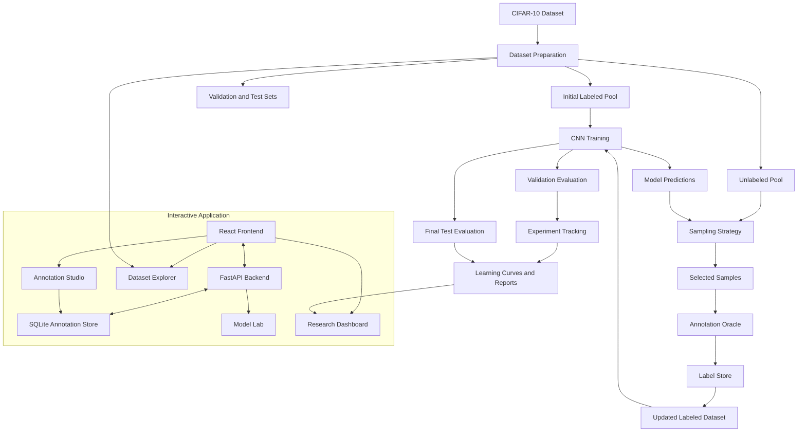
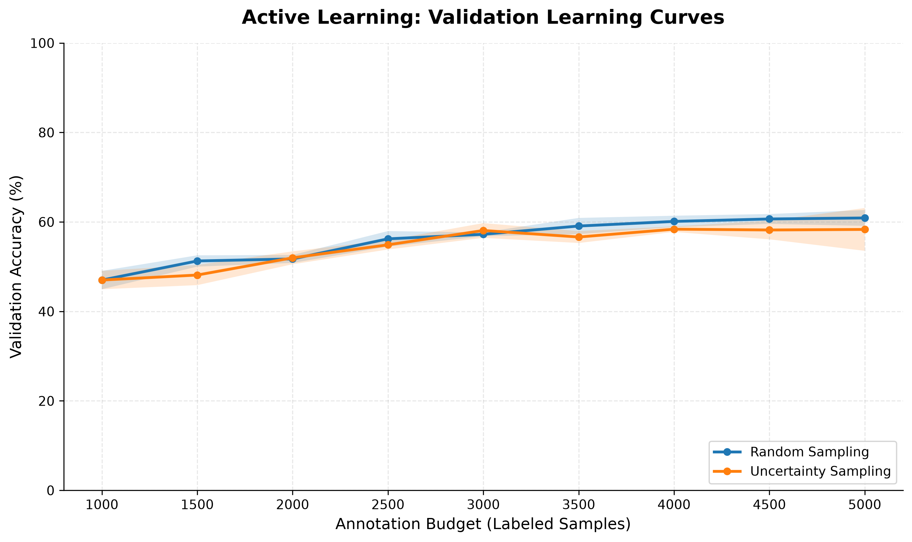
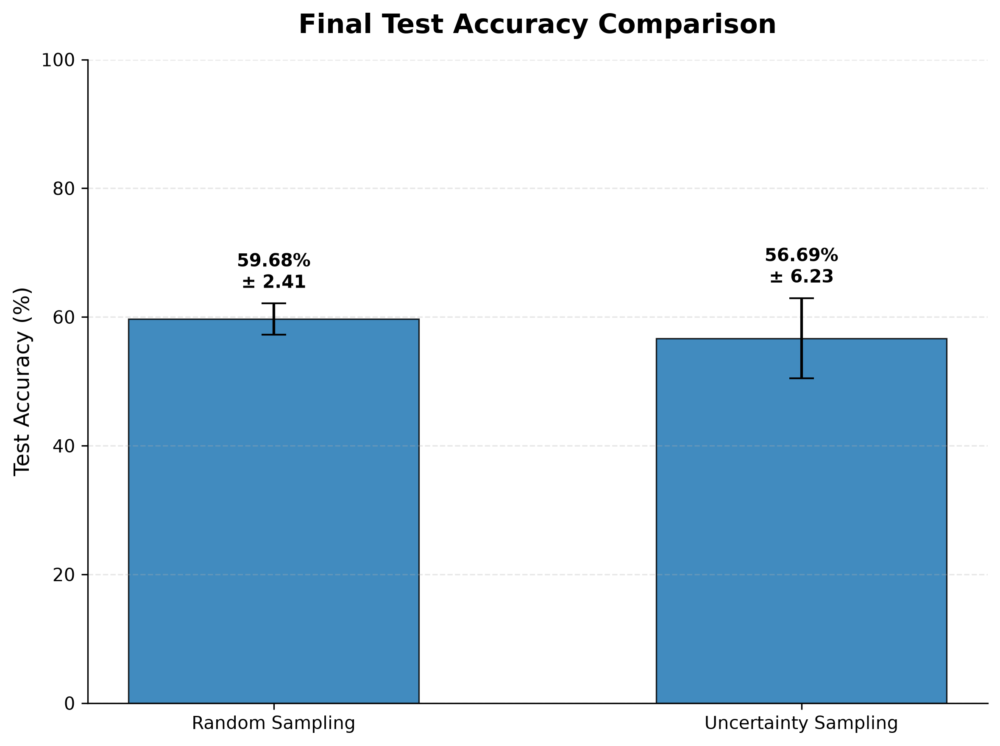
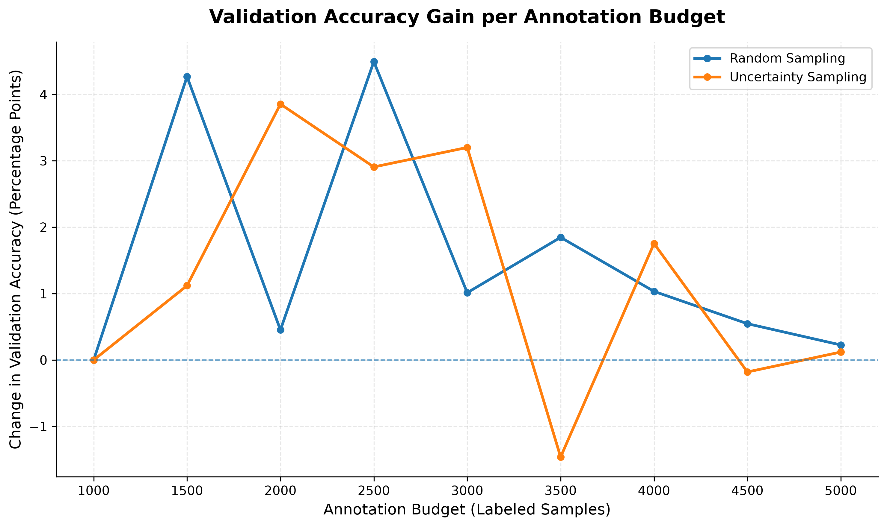

# ORACLE

### Open Research for Active Learning and Continuous Evaluation

**An interactive research platform for studying how intelligent sample selection affects annotation effort and model performance.**

ORACLE combines an active learning research pipeline with a web-based interface for dataset exploration, annotation, experiment tracking, and model evaluation.

It provides a reproducible environment for comparing random and uncertainty-based sample selection strategies on CIFAR-10.

---

## Overview

Machine learning models often require large amounts of labeled data. However, manually annotating data can be expensive, time-consuming, and difficult to scale.

**Active Learning** addresses this challenge by allowing a model to select informative unlabeled samples for annotation.

ORACLE investigates this problem through two sampling strategies:

- **Random Sampling:** Selects unlabeled samples randomly.
- **Uncertainty Sampling:** Prioritizes samples for which the model has low prediction confidence.

The platform combines:

- A modular Python research pipeline.
- A CNN-based image classification model.
- A simulated annotation oracle.
- Persistent annotation storage.
- A FastAPI backend.
- A React-based interactive frontend.
- Experimental metrics and visualizations.
- Model training and evaluation tools.

The objective is to investigate whether intelligent sample selection can improve learning efficiency compared with random selection, while transparently reporting experimental results and limitations.

---

## Key Features

### Research and Active Learning

- CIFAR-10 dataset integration.
- Reproducible dataset splitting.
- Random and uncertainty-based sampling.
- Simulated human annotation.
- Iterative model retraining.
- Multi-seed experimental evaluation.
- Annotation-budget-based learning curves.
- CSV and JSON result exports.

### Interactive Application

- Research Dashboard for experiment analysis.
- Dataset Explorer for browsing CIFAR-10 images.
- Annotation Studio for selecting and saving labels.
- Model Lab for configuring and running training experiments.
- Experiment history and detailed evaluation reports.
- Per-class precision, recall, and F1-score.
- Confusion matrix visualization.
- Persistent annotation records using SQLite.

### Engineering

- Modular project structure.
- FastAPI backend.
- React and Vite frontend.
- Reproducible experiment configuration.
- Separation of training, validation, and test data.
- Error handling and API health checks.

---

## System Architecture



---

## Technology Stack

| Layer | Technologies |
|---|---|
| Programming language | Python, JavaScript |
| Machine learning | PyTorch, Torchvision |
| Data processing | NumPy, Pandas |
| Evaluation | scikit-learn |
| Visualization | Matplotlib, Recharts |
| Backend | FastAPI, Uvicorn |
| Frontend | React 19, Vite |
| UI and animation | Framer Motion, Lucide React |
| Persistent storage | SQLite |
| Dataset | CIFAR-10 |
| Version control | Git, GitHub |

---

## Dataset

ORACLE uses the **CIFAR-10** image classification dataset.

| Property | Description |
|---|---|
| Dataset | CIFAR-10 |
| Training images | 50,000 |
| Test images | 10,000 |
| Image dimensions | 32 × 32 pixels |
| Channels | 3 (RGB) |
| Classes | 10 |
| Task | Multiclass image classification |

### Class Labels

1. Airplane
2. Automobile
3. Bird
4. Cat
5. Deer
6. Dog
7. Frog
8. Horse
9. Ship
10. Truck

### Experimental Split

The original training dataset is divided into three subsets:

| Subset | Samples | Purpose |
|---|---:|---|
| Initial labeled pool | 1,000 | Starting training data |
| Unlabeled pool | 44,000 | Active learning candidate samples |
| Validation set | 5,000 | Model evaluation during training |
| Official test set | 10,000 | Final performance evaluation |

The test set remains separate from training and sample selection.

Unlabeled samples are presented to the sampling strategy without exposing their labels through the sampler interface. Labels are revealed only after samples are selected by the annotation oracle.

---

## Research Methodology

### 1. Random Sampling

Random Sampling selects samples uniformly from the available unlabeled pool without replacement.

**Advantages**

- Simple implementation.
- Low selection overhead.
- Useful experimental baseline.

**Limitation**

It does not consider model uncertainty or sample informativeness.

### 2. Uncertainty Sampling

Uncertainty Sampling selects samples for which the model has low maximum predicted class probability.

For a sample with predicted class probabilities:

\[
P(y \mid x)
\]

The uncertainty score is:

\[
U(x)=1-\max_y P(y\mid x)
\]

A higher uncertainty score indicates lower prediction confidence.

The samples with the highest uncertainty scores are selected for annotation.

**Advantages**

- Uses model predictions to guide sample selection.
- Prioritizes uncertain examples.
- Provides a practical baseline for active learning research.

**Limitations**

- Uncertain predictions are not necessarily the most informative.
- Results can depend on model quality, initialization, and training stability.

### 3. Iterative Learning Process

1. Train the CNN on currently labeled samples.
2. Evaluate validation accuracy.
3. Select a batch of unlabeled samples.
4. Reveal their labels through the annotation oracle.
5. Update the label store and labeled dataset.
6. Increase the annotation budget.
7. Train a fresh model at the new budget.
8. Repeat until the maximum budget is reached.

---

## Experimental Configuration

| Parameter | Value |
|---|---|
| Initial labeled samples | 1,000 |
| Query batch size | 500 |
| Maximum labeled samples | 5,000 |
| Annotation budgets | 1,000 to 5,000 |
| Training epochs per budget | 10 |
| Batch size | 128 |
| Optimizer | Adam |
| Learning rate | 0.001 |
| Loss function | Cross-Entropy |
| Random seeds | 42, 123, 2026 |
| Evaluation metric | Classification accuracy |

Each strategy is evaluated across three random seeds.

Results are summarized using mean accuracy and standard deviation.

---

## Model Architecture

ORACLE uses a custom convolutional neural network (CNN) for CIFAR-10 classification.

The baseline architecture consists of:

- Three convolutional blocks.
- Convolutional layers with 32, 64, and 128 channels.
- Batch normalization.
- ReLU activation.
- Max pooling.
- Fully connected layer with 256 units.
- Dropout with probability 0.3.
- Final classification layer with 10 outputs.

The same model architecture is used for both sampling strategies to support a controlled comparison.

---

## Experimental Results

### Final Test Accuracy

The following results were obtained from three random seeds using a maximum annotation budget of 5,000 samples.

| Strategy | Mean Test Accuracy | Standard Deviation |
|---|---:|---:|
| Random Sampling | 59.68% | 2.41 |
| Uncertainty Sampling | 56.69% | 6.23 |

### Interpretation

In the current experiment, Random Sampling achieved a higher mean final test accuracy than Uncertainty Sampling.

Uncertainty Sampling also showed greater variation across the three random seeds.

These results indicate that uncertainty-based selection did not outperform the random baseline under the current experimental configuration.

However, the experiment uses only three seeds and a limited training budget. The results should therefore be interpreted as preliminary findings rather than a universal conclusion about active learning strategies.

### Validation Accuracy Across Annotation Budgets

| Labeled Samples | Random Sampling | Uncertainty Sampling |
|---:|---:|---:|
| 1,000 | 47.01% | 47.01% |
| 1,500 | 51.27% | 48.13% |
| 2,000 | 51.73% | 51.98% |
| 2,500 | 56.22% | 54.89% |
| 3,000 | 57.23% | 58.09% |
| 3,500 | 59.08% | 56.63% |
| 4,000 | 60.11% | 58.38% |
| 4,500 | 60.66% | 58.20% |
| 5,000 | 60.89% | 58.32% |

The validation results show that performance varies across annotation budgets and sampling strategies. Neither strategy demonstrates a consistent advantage at every intermediate budget.

### Visualizations

#### Learning Curves

Validation accuracy versus annotation budget, with shaded regions representing one standard deviation across random seeds.



#### Final Test Accuracy

Comparison of final test accuracy across the two sampling strategies.



#### Annotation Efficiency

Change in validation accuracy as the annotation budget increases.



---

## Interactive Application

### Research Dashboard

The Research Dashboard brings experimental results together in one place.

It provides:

- Experimental overview.
- Learning curves.
- Annotation efficiency analysis.
- Reproducibility information.
- Strategy comparison.
- Model Lab experiment history.

### Dataset Explorer

The Dataset Explorer allows users to browse CIFAR-10 images and inspect dataset information.

Features include:

- Image gallery.
- Dataset summary.
- Image retrieval through the backend API.
- Annotation-related exploration.

### Annotation Studio

The Annotation Studio provides an interface for recording annotation decisions.

Features include:

- Image inspection.
- Class selection.
- Persistent annotation records.
- Annotation history.
- Duplicate protection.

### Model Lab

The Model Lab allows users to configure and execute training experiments.

Features include:

- Configurable training parameters.
- Background training.
- Training progress and status.
- Training and validation loss curves.
- Accuracy tracking.
- Experiment history.
- Best-checkpoint evaluation.
- Per-class classification reports.
- Confusion matrix visualization.

Model Lab evaluation reports include test accuracy, macro and weighted precision, recall, F1-score, and per-class support.

---

## Project Structure

```text
ORACLE/
│
├── backend/
│   ├── main.py
│   ├── model_lab.py
│   └── README.md
│
├── frontend/
│   ├── public/
│   ├── src/
│   │   ├── App.jsx
│   │   ├── App.css
│   │   ├── ModelLab.jsx
│   │   ├── dataset-explorer.css
│   │   ├── model-lab.css
│   │   ├── index.css
│   │   └── main.jsx
│   ├── package.json
│   └── vite.config.js
│
├── src/
│   ├── active_learning/
│   │   ├── annotation_oracle.py
│   │   ├── label_store.py
│   │   ├── labeled_dataset.py
│   │   ├── random_sampler.py
│   │   └── uncertainty_sampler.py
│   │
│   ├── data/
│   │   ├── dataset.py
│   │   └── unlabeled_dataset.py
│   │
│   └── models/
│       └── cnn.py
│
├── experiments/
│   ├── plots/
│   ├── model_lab/
│   ├── multi_seed_comparison.py
│   ├── compare_strategies.py
│   ├── plot_results.py
│   ├── multi_seed_metrics.csv
│   ├── multi_seed_aggregate.csv
│   ├── multi_seed_test_summary.json
│   └── multi_seed_summary.json
│
├── tests/
│
├── app.py
├── train_baseline.py
├── test_dataset.py
├── README.md
└── .gitignore
```

Dataset files, local SQLite databases, virtual environments, and model checkpoints are excluded from version control.

---

## Installation and Setup

### Prerequisites

- Python 3.10 or later, compatible with the installed PyTorch and Torchvision versions.
- Node.js and npm.
- Git.
- pip.

### 1. Clone the Repository

```powershell
git clone https://github.com/kishanbishwakarma0/ORACLE.git
cd ORACLE
```

### 2. Create a Python Virtual Environment

Windows PowerShell:

```powershell
python -m venv .venv
.\.venv\Scripts\Activate.ps1
```

### 3. Install Python Dependencies

Install a compatible PyTorch and Torchvision build using the official PyTorch installation selector.

Then install the remaining dependencies:

```powershell
python -m pip install --upgrade pip

pip install fastapi uvicorn pillow numpy pandas matplotlib scikit-learn tqdm
```

Ensure that the installed environment can import `torch` and `torchvision`.

### 4. Install Frontend Dependencies

Open a new terminal and navigate to the frontend directory:

```powershell
cd frontend
npm install
```

---

## Running the Application

ORACLE uses separate backend and frontend development servers.

### Start the Backend

From the project root:

```powershell
.\.venv\Scripts\Activate.ps1

python -m uvicorn backend.main:app --reload --host 127.0.0.1 --port 8000
```

Backend address:

```text
http://127.0.0.1:8000
```

Interactive API documentation:

[http://127.0.0.1:8000/docs](http://127.0.0.1:8000/docs)

The first dataset request may download CIFAR-10.

### Start the Frontend

Open another terminal:

```powershell
cd frontend
npm run dev
```

Vite will display the local frontend address in the terminal, typically:

```text
http://localhost:5173
```

If the default port is already in use, Vite may select another available port.

The frontend uses the local backend by default. To configure a different backend URL, set the `VITE_API_URL` environment variable before starting the frontend.

---

## API Endpoints

| Method | Endpoint | Description |
|---|---|---|
| GET | `/api/health` | API health |
| GET | `/api/dataset/summary` | Dataset metadata |
| GET | `/api/images/{image_index}` | Retrieve an image without exposing its label |
| GET | `/api/annotations` | Retrieve saved annotations |
| POST | `/api/annotations` | Save a chosen class |
| DELETE | `/api/annotations/{image_index}` | Remove an annotation |
| GET | `/api/experiments/metrics` | Retrieve experiment metrics and artifact availability |
| POST | `/api/model-lab/train` | Start a training experiment |
| GET | `/api/model-lab/status` | Retrieve current training status |
| GET | `/api/model-lab/experiments` | List saved experiments |
| GET | `/api/model-lab/experiments/{experiment_id}` | Retrieve experiment details and evaluation |

Annotation records are stored locally in:

```text
data/annotations.sqlite
```

Model Lab history and checkpoints are stored under:

```text
experiments/model_lab/
```

---

## Running the Research Experiments

### Run Multi-Seed Comparison

From the project root:

```powershell
python -m experiments.multi_seed_comparison
```

This executes the configured experiments and saves metrics, summaries, and final model checkpoints.

**Note:** The experiment involves repeated CNN training and may take considerable time on a CPU. A compatible GPU can reduce training time.

### Generate Visualizations

After experiment results are available:

```powershell
python -m experiments.plot_results
```

Generated figures are saved in:

```text
experiments/plots/
```

The visualization script reads existing results and does not retrain the models.

---

## Testing

Run the active learning pipeline tests from the project root:

```powershell
python -m tests.test_unlabeled_dataset

python -m tests.test_uncertainty_sampler

python -m tests.test_active_learning_pipeline
```

The tests verify:

- Image-only access to unlabeled samples.
- Original index mapping.
- DataLoader compatibility.
- Uncertainty ranking.
- Sampling pool updates.
- Invalid query handling.
- Annotation tracking.
- Label storage.
- End-to-end pipeline integration.

---

## Reproducibility

ORACLE uses fixed random seeds to support reproducible experimentation.

The current experiment uses:

- Seed 42.
- Seed 123.
- Seed 2026.

Results are exported to CSV and JSON files to support further analysis.

The reported standard deviations describe variation across these three runs; they are not confidence intervals.

Exact reproduction can still depend on hardware, software versions, and nondeterministic operations in the underlying deep learning framework.

---

## Limitations

The current implementation has several limitations:

1. Only three random seeds are used.
2. The CNN is a relatively small baseline architecture.
3. The training budget is limited to 5,000 labeled samples.
4. Uncertainty Sampling uses maximum softmax probability, which may not fully capture sample informativeness.
5. The annotation oracle simulates labels rather than involving real human annotators.
6. Annotation time and computational cost are not yet incorporated into the main comparison.
7. The current experiments do not establish statistical significance.

These limitations provide opportunities for future investigation.

---

## Future Work

Potential extensions include:

- Additional active learning strategies such as entropy sampling and margin sampling.
- Larger multi-seed experiments.
- Confidence calibration.
- Class distribution and diversity analysis.
- Annotation cost tracking.
- Model inference and training time comparison.
- Evaluation on additional datasets.
- Further improvements to reproducibility and deployment.

---

## Research Contribution

ORACLE provides a modular experimental environment for studying the relationship between annotation budget, sample selection, and classification performance.

Its primary contribution is a reproducible comparison framework that combines controlled dataset splits, simulated annotation, iterative training, multiple random seeds, and transparent result reporting.

The current findings also demonstrate why active learning strategies should be evaluated empirically rather than assumed to outperform random sampling.

---

## Acknowledgements

- CIFAR-10 dataset.
- PyTorch.
- Torchvision.
- NumPy.
- Pandas.
- Matplotlib.
- scikit-learn.
- FastAPI.
- React.

---

## Author

**Kishan Bishwakarma**

B.Tech — Computer Science and Engineering (AI & ML)

GitHub: [@kishanbishwakarma0](https://github.com/kishanbishwakarma0)

Project: [ORACLE](https://github.com/kishanbishwakarma0/ORACLE)